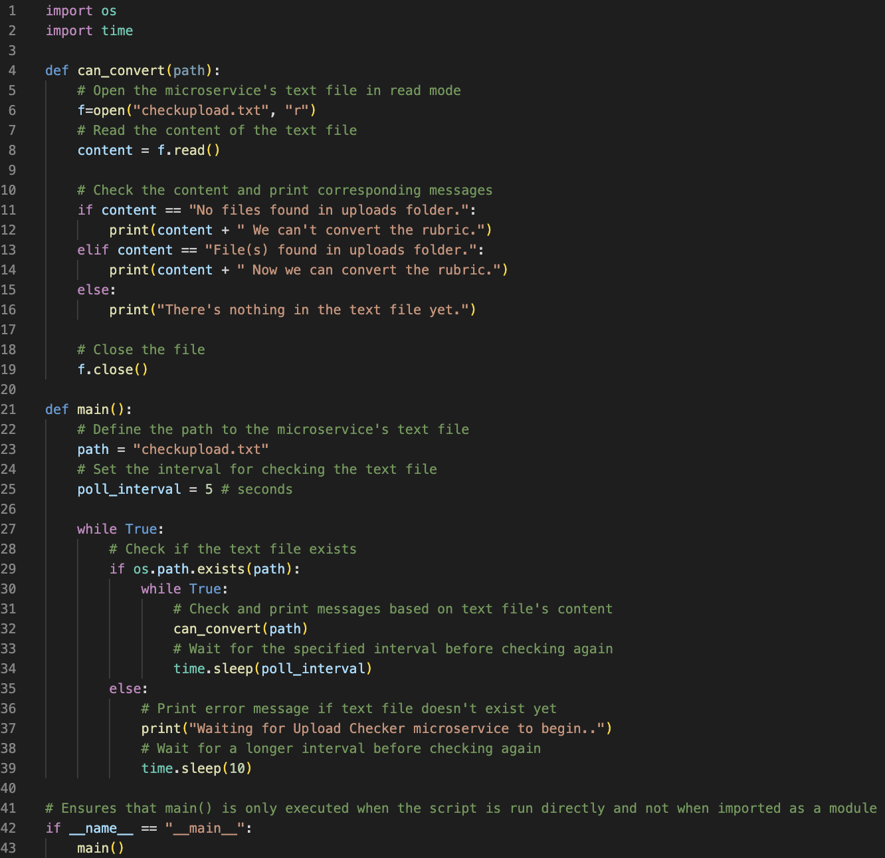
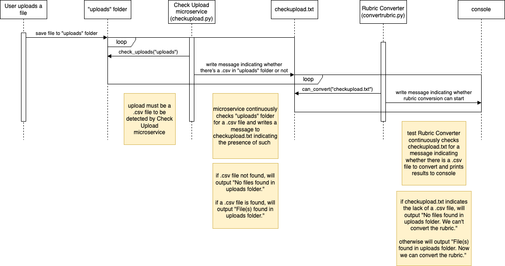

# Check Upload Microservice 
This microservice, checkupload.py, incrementally checks the "uploads" folder and updates a message to checkupload.txt that indicates the presence of a .csv file. There are two possible outputs in the text file: "No files found in uploads folder." and "File(s) found in uploads folder." 

# How to Request & Receive Data from the Check Upload Microservice
As this microservice primarily communicates via checkupload.txt, a program must open and read the contents of checkupload.txt to receive outputted data about the "uploads" folder. An example implementation of this is seen in convertrubric.py:

In this example, convertrubric.py is opening and reading checkupload.txt every 5 seconds before determining whether rubric conversions on the .csv file can begin.

# UML Sequence Diagram

